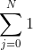
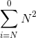
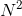

# Bubble Sort

Bubble sort é um dos métodos de ordenação mais simples para implementação, em contra partida, ele paga o preço na questão performance. Na maioria das vezes, a quantidade de execuções de sua operação básica será `n²`, podendo executar "apenas" `n` vezes quando o conjunto `n` de dados já estiver ordenado.

## Implementação

```Javascript
const BubbleSort = data => {
    for (let i = data.length-1; i > 0; i--) {
        for (let j = 0; j < i; j++) {
            if (data[j] > data[j+1]) {
                const aux = data[j];
                data[j] = data[j+1];
                data[j+1] = aux;
            }
        }
    }
    return data;
}
```

```Javascript
> BubbleSort([3,2,1,5,6,4,7,3,5,8,5,35,7454,4,64,745,34])
[ 1, 2, 3, 3, 4, 4, 5, 5, 5, 6, 7, 8, 34, 35, 64, 745, 7454 ]
```

## Conceito matemático

Observando o código acima, podemos notar que o `if` interno é executado para cada uma das repetições. Esse conceito é chamado de operação básica, e para podermos calcular o custo deste código, devemos primeiramente, atribuir um valor de custo para essa operação. É comum na academia atribuirmos o custo `1`.

Notamos que acima da operação básica \(no caso o `if`\), temos um laço de execução. Isso significa que essa operação básica será executada sempre que uma repetição do laço for feita. Também notamos que inicialmente a variável de iteração do laço inicia em 0 e termina em um valor desconhecido \(no código representado pela variável i\). Esse valor desconhecido, é referente ao laço anterior \(primeiro laço de execução\) e podemos ver que ele varia de acordo com o tamanho da entrada \(em código `data.length`\).

Matematicamente podemos escrever esse laço de repetição utilizando um somatório, neste caso, é um somatório de 0 até o tamanho da variável que no pior caso, é o tamanho do vetor de entrada \(`data.length` ou simplesmente `n`\).



Repetindo a lógica anterior, é só adicionar mais um somatório para o laço de repetição mais externo, que também repete `n` vezes.


Utilizando operações com somatórios, podemos simplifica-los da seguinte forma:





Dessa forma, podemos constatar que o custo deste código é `n²` ou de uma forma mais formal, a sua curva assintótica é `O(n²)` no pior caso.

Em termos práticos, isso significa que em uma entrada de 10 elementos no vetor, no pior caso, este código irá executar o `if` \(operação básica\) 100 vezes, 10². Já em uma entrada de 100 elementos no vetor acarretará em uma execução de 10000, 100² e assim até o infinito.

